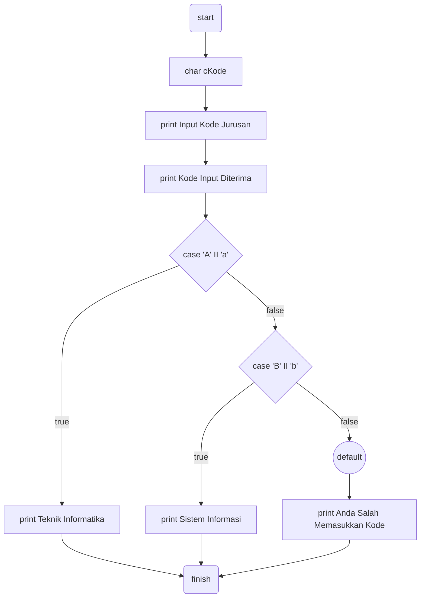

```mermaid
    flowchart TD;
    A(start) --> B[char cKode];
    B --> C[print Input Kode Jurusan];
    C --> D[print  Kode Input Diterima];
    D --> E{case 'A' II 'a'};
    E --true--> F[print Teknik Informatika];
    E --false--> G{case 'B' II 'b'};
    G --true--> H[print Sistem Informasi];
    G --false--> I((default));
    I --> J[print Anda Salah Memasukkan Kode];
    F & H & J --> K(finish);
   
```