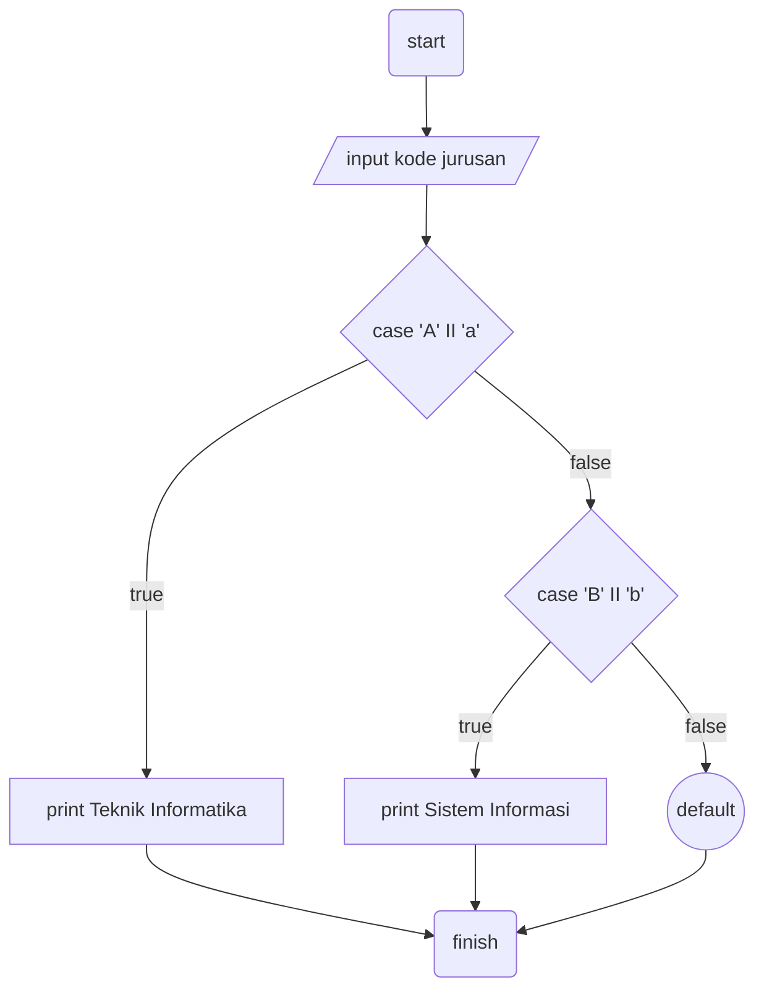

```mermaid
    flowchart TD;
    A(start) --> B[/input kode jurusan/];
    B --> C{case 'A' II 'a'};
    C --true--> D[print Teknik Informatika];
    C --false--> E{case 'B' II 'b'};
    E --true--> F[print Sistem Informasi];
    E --false--> G((default));
    D & F & G --> H(finish);
   
```