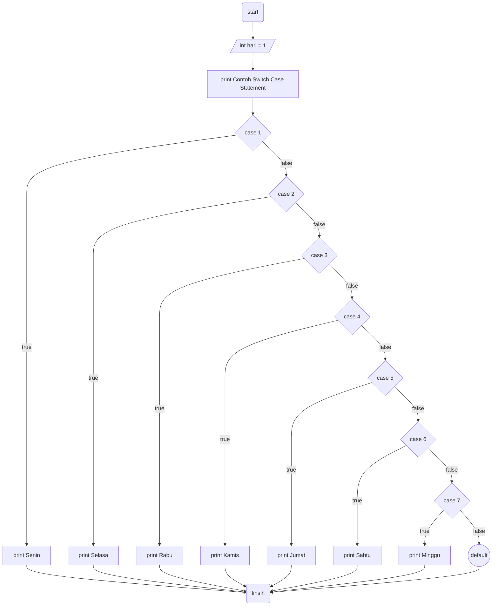

```mermaid
    flowchart TD;
    A(start) --> B[/ int hari = 1/];
    B --> C[print Contoh Switch Case Statement];
    C --> D{case 1};
    D --true--> E[print Senin];
    D --false--> F{case 2};
    F --true--> G[print Selasa];
    F --false--> H{case 3};
    H --true--> I[print Rabu];
    H --false--> J{case 4};
    J --true--> K[print Kamis];
    J --false--> L{case 5};
    L --true--> M[print Jumat];
    L --false--> N{case 6};
    N --true--> O[print Sabtu];
    N --false--> P{case 7};
    P --true--> Q[print Minggu];
    P --false--> R((default));
    E & G & I & K & M & O & Q & R --> S(finsih);

```
